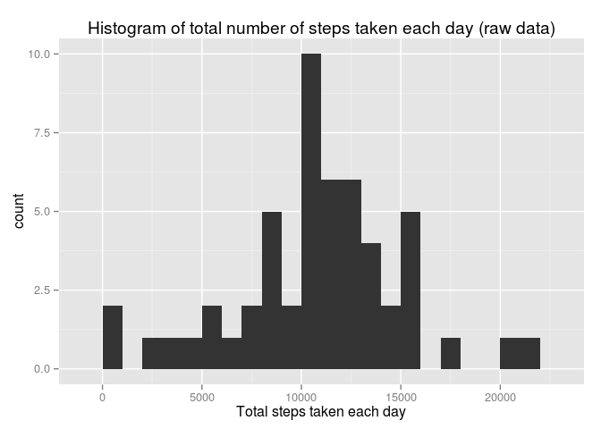
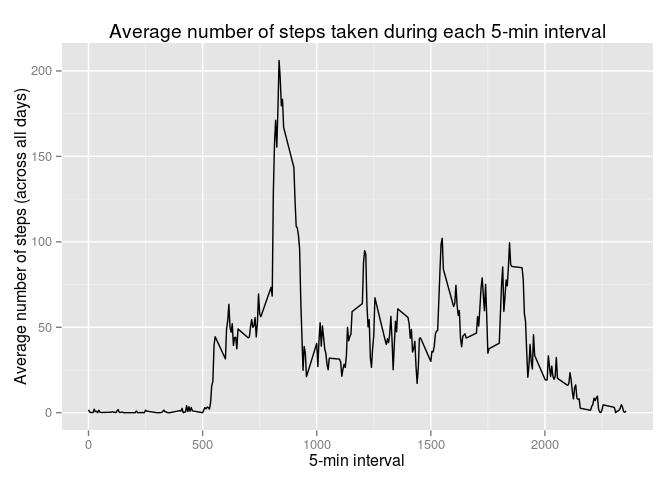
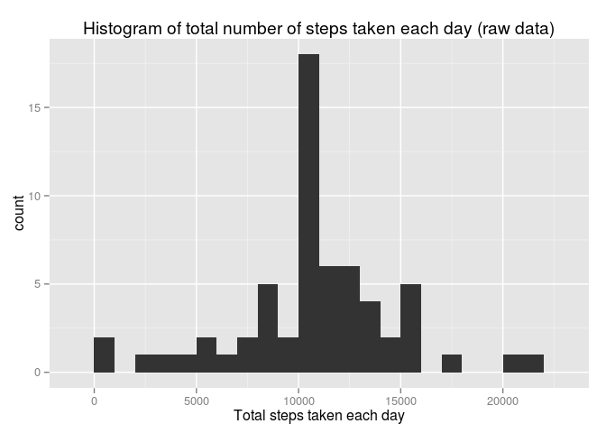
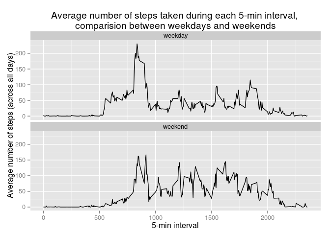

# Reproducible Research: Peer Assessment 1

## Loading and preprocessing the data
The data for this research can be downloaded from the course web site: 

* Dataset: [Activity monitoring data](https://d396qusza40orc.cloudfront.net/repdata%2Fdata%2Factivity.zip)

The variables included in this dataset are: 

* steps: Number of steps taking in a 5-minute interval (missing values are coded as NA)
* date: The date on which the measurement was taken in YYYY-MM-DD format
* interval: Identifier for the 5-minute interval in which measurement was taken

The dataset is stored in a comma-separated-value (CSV) file and there are a total of 17,568 observations in this dataset.


```r
read_activity_data = function(zip_file_location) {
    # check if given location exists
    if (!file.exists(zip_file_location)) {
        print(paste(zip_file_location, "doesn't exist."))
        return()
    }
    
    # Unzip the file
    unzip(zip_file_location, exdir = "./data")
    
    # activity.zip contains activity.csv
    data_file = "./data/activity.csv"
    if (!file.exists(data_file)) {
        print(paste(data_file, "doesn't exist."))
        return()
    }
    
    # Read csv data
    raw_data = read.csv(data_file)
    
    raw_data
}

zip_file_location = "activity.zip"
activity_data = read_activity_data(zip_file_location)
```


## What is mean total number of steps taken per day?

```r
library(dplyr)
```

```
## 
## Attaching package: 'dplyr'
## 
## The following objects are masked from 'package:stats':
## 
##     filter, lag
## 
## The following objects are masked from 'package:base':
## 
##     intersect, setdiff, setequal, union
```

```r
library(ggplot2)
```

Below is a histogram representing the total number of steps taken per day by the subject

```r
#Calculate the total number of steps taken per day
activity_data.by_day = group_by(activity_data, date)
activity_data.total_steps_by_day = summarise(activity_data.by_day, 
                                             total_steps = sum(steps))

#Make a histogram of the total number of steps taken each day
qplot(activity_data.total_steps_by_day$total_steps, geom = "histogram",
      binwidth = 1000, 
      main = "Histogram of total number of steps taken each day (raw data)",
      xlab = "Total steps taken each day")
```

 


```r
#Find the mean and median of the total number of steps taken per day
s = summary(activity_data.total_steps_by_day$total_steps)
s[c("Median", "Mean")]
```

```
## Median   Mean 
##  10760  10770
```
The mean total number of steps taken per day by the subject is 10770, and the 
median is 10760.

## What is the average daily activity pattern?
Here is a plot to understand the average daily activity pattern. 

```r
# Make a time series plot (i.e. type = "l") of the 5-minute interval (x-axis) and the average number of steps taken, averaged across all days (y-axis)

activity_data.by_interval = aggregate(steps ~ interval, data = activity_data, 
                                      FUN = mean)

plot = ggplot(activity_data.by_interval, aes(interval, steps)) +
    labs(title = "Average number of steps taken during each 5-min interval") +
    labs(x = "5-min interval", y = "Average number of steps (across all days)") +
    geom_line()

plot
```

 


```r
activity_data.by_interval[which(activity_data.by_interval$steps == max(activity_data.by_interval$steps)), ]
```

```
##     interval    steps
## 104      835 206.1698
```
The subject took the maximum number of steps (averaged across all days) in the *835th* interval.

## Imputing missing values

```r
activity_data.missing = activity_data[which(is.na(activity_data$steps)),]
nrow(activity_data.missing)
```

```
## [1] 2304
```
There were a total of 2304 missing values (rows with NAs) in the steps variable of the dataset.

The presence of missing values may introduce bias into some calculations of summaries of the data. 

**Imputing Strategy**: For any missing value of steps, use the average steps for that interval across all days

```r
# Compute the average by removing NAs
activity_data.by_interval = aggregate(steps ~ interval, data = activity_data, 
                                      FUN = mean, na.rm = TRUE)

# Generate a new df containing two columns for steps, 
# one with original value in the dataset, and another with average value for that interval 
activity_data.imputed = merge(x = activity_data, y = activity_data.by_interval,
                              by = "interval", all.x = TRUE)

# Add a new column with the average value for that inteval if the original value is NA
activity_data.imputed$steps = ifelse(is.na(activity_data.imputed$steps.x), 
                                     activity_data.imputed$steps.y,
                                     activity_data.imputed$steps.x)

# Cleanup the columns
activity_data.imputed = activity_data.imputed[, c("date", "interval", "steps")]
```


Below is a histogram representing the total number of steps taken per day by the subject

```r
#Calculate the total number of steps taken per day
activity_data.imputed.by_day = group_by(activity_data.imputed, date)
activity_data.imputed.total_steps_by_day = summarise(activity_data.imputed.by_day, 
                                                     total_steps = sum(steps))

#Make a histogram of the total number of steps taken each day
qplot(activity_data.imputed.total_steps_by_day$total_steps, geom = "histogram",
      binwidth = 1000,
      main = "Histogram of total number of steps taken each day (raw data)",
      xlab = "Total steps taken each day")
```

 


```r
#Find the mean and median of the total number of steps taken per day
s = summary(activity_data.imputed.total_steps_by_day$total_steps)
s[c("Median", "Mean")]
```

```
## Median   Mean 
##  10770  10770
```
After filling the missing values, the mean total number of steps taken per day by the subject is 10770, and the median is 10770. 


## Are there differences in activity patterns between weekdays and weekends?


```r
# Convert date variable to 'Date' class
activity_data.imputed$date = as.Date(activity_data.imputed$date)

# Create a new column based on weekday from the 'date' variable
activity_data.imputed$part_of_week = ifelse(weekdays(activity_data.imputed$date) %in%
                                            c("Saturday", "Sunday"), 
                                            "weekend", "weekday")

# Convert new column to factor
activity_data.imputed$part_of_week = factor(activity_data.imputed$part_of_week)

# Compute average of steps by interval and part of week
activity_data.imputed = group_by(activity_data.imputed, interval, part_of_week)

activity_data.imputed.avg_steps_by_interval_by_pow = summarise(activity_data.imputed, 
                                                               avg_steps = mean(steps))


# Set parameters to get 
par(mfrow = c(1,2), mar = c(5, 5, 3, 1))

plot = ggplot(activity_data.imputed.avg_steps_by_interval_by_pow, aes(interval, avg_steps)) +
    facet_wrap( ~ part_of_week, ncol = 1) + 
    labs(title = "Average number of steps taken during each 5-min interval, 
comparision between weekdays and weekends") +
    labs(x = "5-min interval", y = "Average number of steps (across all days)") +
    geom_line()

plot
```

 


